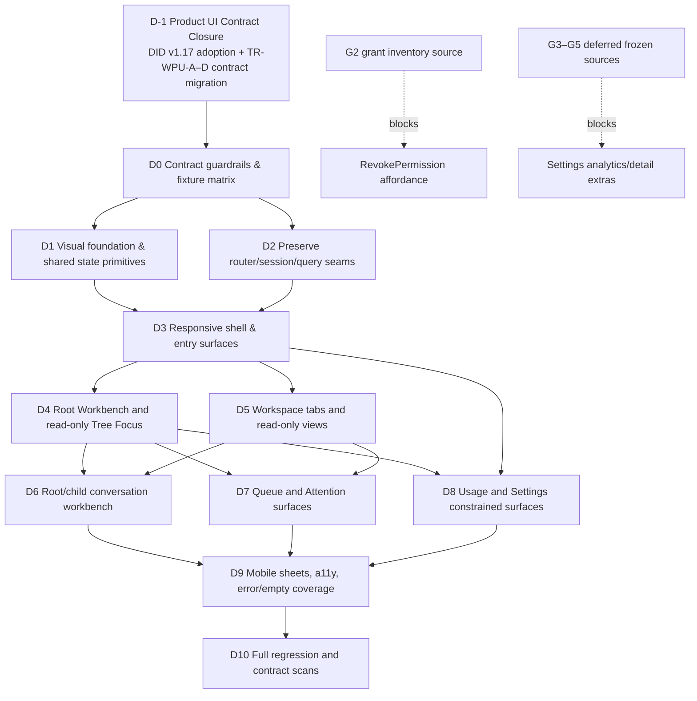

# Arbor Web Product UI — Implementation Specification

**状态：** FROZEN product implementation baseline；DID v1.17 D-1 已采纳其
TR-WPU-A–D 的 presentation/read-model closure。D0–D10 Web product implementation
仍未获授权；本文件本身不授权超出 D-1 的 `apps/web` route/component/visual work。
**设计输入：** `docs/arbor-ui-designs.zip`（3 张系统参考图、7 张最终页面图）。
**冻结依据（优先级由高到低）：** 已裁决的 Web Product UI Contract Closure
`02-contract-closure.md`（DID v1.17 已采纳）→ P14 `00`–`05`（尤其
`04-web-surface`）→ P13 `00`–`06` → `packages/api-contracts/src/views.ts` → Web
v1 product contract `planning/proposals/web-v1/01-ui-ia-design.md`。P14 的 TR-C 覆盖
Web v1 原先的 chat defer：root workspace 有 conversation tab；child 仍然只读。

## 1. Scope and non-negotiables

本规格把设计图当作视觉、密度和信息层级的输入；它们**不是**后端契约。每个
实现面只能消费冻结的九个 `/views/:view` DTO、`POST /commands` 的八个
human-actionable 命令和 WS invalidation。以下规则不因视觉稿而改变：

- TanStack Query 是唯一 server-state cache；WS 只触发 invalidate/refetch，
  不携带 DTO、不写缓存；没有 optimistic state、浏览器端 totals 或第二套
  projection。
- 认证 token/actor 只保留在内存；没有密码、OAuth、remember-me、cookie 或
  浏览器存储。URL 中的 `projectId` 是项目身份；session 中的 projectId 仅是
  最近选择记忆。
- 只有 `CreateProject`、`RecordDecision`、`SteerWork`、`AcceptWorkOutcome`、
  `StopExecution`、`GrantPermission`、`RevokePermission`、
  `SubmitHumanMessage` 可以成为主动 UI 命令。authority 仍由服务器裁决。
- `SubmitHumanMessage` 只在 tree 中唯一 `parentWorkspaceId === null` 所指的 root workspace 生效；不建
  `/chat`，不暴露 `SendMessage` 或 `AdmitExecution`，不流式显示、不自行插入
  chat turn，也不在 chat 中放 steer/stop。
- Tree 是只读导航；Attention 是只读诊断；Queue 只放具有机械、精确 action
  target 的事项。未知枚举原样 muted 显示，`cost: Unknown` 不是 0，ISO 时间要
  本地化且可查看原值。
- TR-WPU-A 仅 supersede P13 的视觉样式约束：采用 modern minimal light、white/
  warm-neutral surfaces、Arbor Green、sans UI/body、mono technical metadata 和新
  spacing/radius/density。不得引入图标库、dark mode 或 Search 产品域；所有 P13/P14
  API、command、auth、WS 和 server-state 约束不变。

## 2. Design asset → implementation surface mapping

下表是一张设计资产对应一个命名实现目标的映射。若图中同时展示桌面与移动态，
目标仍是同一 route surface 的响应式变体；不会为截图另造后端域或路由。

| 设计资产 | 一一对应的实现目标 | 路由/作用域 | 采用的视觉意图 | 冻结调整 |
|---|---|---|---|---|
| `specs/01-design-system.png` | `ArborVisualFoundation` | 无路由，共享 | 信息层级、卡片、表格、表单、dialog/sheet 的一致密度 | 采用 TR-WPU-A 的 light/Arbor Green/sans token system；不要求复刻蓝色主色，亦不引入外部 icon library。 |
| `specs/02-auth-project-entry-global-states-components.png` | `SessionAndProjectEntry` | 未认证 gate；已认证且无项目时 `/` | 居中进入卡、项目起始引导、全局状态组件 | 只允许 token + actor 内存连接及 CreateProject；没有账号密码、OAuth、项目列表或持久登录。 |
| `specs/03-design-system-entry-states-reference.png` | `ProductStatePrimitives` | 无路由，共享 | loading/empty/problem、桌面 rail、移动 bottom sheet 参考 | 所有错误必须映射 P13 的六类 Problem；不以截图文案虚构权限、数据冲突或任务状态。 |
| `final-pages/01-workbench-tree-conversation.png` | `RootConversationWorkbench` | `/p/:projectId`（canonical）；root conversation tab 是 deep-link mirror | 桌面双栏的 tree graph/context + 对话、当前项目工作台感 | 左栏只使用 server-projected `parentWorkspaceId`；composer 始终绑定 tree 确认的 root，不跟随所选 child。无 `/workbench`、无任意节点 chat。 |
| `final-pages/02-pending-queue.png` | `GovernanceQueuePage` | `/p/:projectId/queue` | 左侧事项列表、右侧选中详情与显式决策 | 只能对结构化 `gov:` target 显示 Approve/Reject；没有 defer/handle-later 命令，未结构化项只读。 |
| `final-pages/03-attention.png` | `AttentionPage` | `/p/:projectId/attention` | severity 列表 + 桌面检查面板 | 面板仅显示 Attention DTO 的 source/severity/summary/time/target；没有“转待处理”或其他 mutation。 |
| `final-pages/04-work-verification-detail.png` | `WorkDetailPage` | `/p/:projectId/workspace/:workspaceId/work/:workId` | 工作生命周期头、验证区、相关上下文 | 只显示 frozen detail/verification 字段；进度百分比、阶段、统计图不造数。动作受 revision-source gate 约束。 |
| `final-pages/05-usage.png` | `UsagePage` | `/p/:projectId/usage` | 强调用量的总览、切换和可扫读明细 | 当前只能实现 `groupBy` + server rows 表，不能实现日期范围、趋势、provider/model/task 图或浏览器聚合。 |
| `final-pages/06-project-settings.png` | `SettingsPage` | `/p/:projectId/settings` | 分区设置、权限与会话管理 | 当前只落 project creation/switch、GrantPermission、可读 session；members/provider/runtime/storage/notifications 均无冻结来源或命令。 |
| `final-pages/07-mobile-workbench-conversation-tree-context.png` | `MobileRootConversationWorkbench` | `/p/:projectId` 的 `<768px` 变体 | 单列对话、tree context、底部 project sheet | 保留 `工作台/树/待处理/关注/更多` 底栏；sheet 只用已取到的项目/工作区数据，不能显示未冻结的 model/runtime 或“新建工作”。 |

## 3. Route inventory

| Route | Canonical page | Access and identity rule |
|---|---|---|
| `/` | Session/project entry | 仅是未选项目时的本地 bootstrap surface，不是正式项目路由。已连接且 session 记有 projectId 时 replace 到项目 Workbench。 |
| `/p/:projectId` | Root Workbench | 项目 canonical landing：Tree + Root Conversation。 |
| `/p/:projectId/tree` | Tree Focus | 只读组织结构 focus/deep-link。 |
| `/p/:projectId/queue` | Governance Queue | 跨已返回工作区的可操作事项聚合。 |
| `/p/:projectId/attention` | Attention | 只读诊断。 |
| `/p/:projectId/usage` | Usage | server rows 的三种 groupBy。 |
| `/p/:projectId/settings` | Settings | 权限、项目入口、会话。 |
| `/p/:projectId/workspace/:workspaceId` | Workspace overview | `tab=overview` 的 canonical URL。 |
| `/p/:projectId/workspace/:workspaceId/:tab` | Workspace tab | `overview/dependencies/verification/transcript/inbox/conversation`；tab 是 URL state。 |
| `/p/:projectId/workspace/:workspaceId/work/:workId` | Work Detail | 只从父 workspace 的可见 work reference 下钻或直达。 |

没有 `/chat`、`/workbench`、`/search`、成员/模型/运行时设置子路由。路由只表达 UI
状态，不表达或改变 server semantic state。

## 4. Shared shell and state ownership

### Global App Shell

- **Layout:** `AppShell > Rail > ProjectSwitcher + PrimaryNav + SessionBlock`，
  `Topbar > Breadcrumbs + FreshnessChip + global-problem banner slot`，以及 route
  outlet。桌面采用 rail + content；不能把 chat 变成第七个一级导航。
- **Component tree:**
  `ErrorBoundary > SessionProvider > QueryClientProvider > WSInvalidationProvider > SessionGate > AppShell`。
  outlet 中的每个查询区再用 `ViewSection(QueryState, Empty, ProblemCard)` 包住。
- **Responsive:** `>=1280` 208px rail、内容可有详情侧栏；`768–1279` 窄 rail、
  二栏内容可上下堆叠、表格横滚；`<768` 为单列，rail 改为
  `工作台/树/待处理/关注/更多` 固定底栏，Usage/Settings/刷新/断开入 more sheet。
  Topbar 只保留上下文与新鲜度。
- **Server state:** shell 不拥有业务 DTO。它只消费 WS 连接状态和 session memory；
  所有页面业务数据仍来自其声明的 `useViewQuery`。
- **Allowed actions:** route navigation、项目 ID 深链输入、refresh（invalidate
  query）、断开 session。项目切换不意味着项目发现；没有项目列表时不得伪造。
- **States:** 未认证为全局 token/actor gate；`unauthenticated` problem 也回到全局
  gate；`stale` 为顶部/就地明确提示且可 retry；其它 query problem 在拥有它的区域
  显示，不遮蔽其他独立区块；ErrorBoundary 只提供 reload，不恢复业务状态。

### Query and command discipline

`queryKey = ["view", viewId, request]`，命令回执 Committed 后 invalidate 相关
`["view"]` keys；transport 失败必须复用同一个 commandId，且有 caller-preallocated
标识的命令还要复用其 `msg_`/`acp_`/`pgr_` 标识。TerminalRejected 内联显示、保持
可编辑；绝不根据客户端权限猜测来预先隐藏服务器错误。

## 5. Page specifications

### 5.1 Session and project entry

- **Route:** 未认证时覆盖任何 URL；认证后只有在没有项目路由/记忆时显示 `/`。
- **Layout / component tree:** `SessionGate > LoginCard(token, actor)`；连接成功后
  `BootstrapPage > CreateProjectForm`。采用设计图中窄居中 card 和简短帮助说明，
  不让 rail 在登录态分散注意力。
- **Responsive:** 所有宽度单列，移动端 card 去掉浮层阴影而保留边界和可触达的表单。
- **Server-state source:** 无项目发现 view；session 是内存 local state。CreateProject
  只通过 command receipt 获得结果，成功后用 receipt 的 project/workspace ID 导航；
  receipt 不完整时去新项目 Workbench。
- **Allowed actions:** 输入 token/actor 并连接；CreateProject。不能显示/调用 OAuth、
  password reset、remember me 或选择不存在的项目目录。
- **Empty / loading / error:** 空 token/actor 是 client validation；命令提交为 disabled
  submit + inline receipt/problem；认证失败显示全局 unauthenticated gate；无 recent
  project 不是错误，显示 CreateProject 引导。

### 5.2 Root Workbench (canonical landing)

- **Route:** `/p/:projectId`；它替代独立 Overview dashboard 作为正式项目入口。
- **Layout / component tree:** `RootWorkbenchPage > WorkbenchHeader + TreeGraphPane +
  RootConversationPane`。`TreeGraphPane` 显示 server parent edge、name、status、
  attention/current-work/usage 摘要；`RootConversationPane` 为
  `TranscriptList + QueueStatus + SubmitHumanMessageComposer`。旧
  `GovernanceDigest`/`TreeTopSnapshot`/`HealthUsageSummary` 不再是 landing 的必经
  dashboard；九个 server views 保留并继续在 Queue/Attention/Usage/Workspace 等其
  他现有 surface 中消费。
- **Responsive:** `>=1024` graph/context 与 conversation 双栏；`768–1023` graph
  可收为顶部 context 面板；`<768` conversation 优先，graph 进入 disclosure/sheet，
  而全局底栏的首项为“工作台”。每个 pane 独立高度/状态，不能因一个 query 失败将
  另一个置空。
- **Server-state source:** `responsibility-tree({projectId})` 给出 root、preorder 及
  server-projected `parentWorkspaceId` graph edges；成功后必须在响应中确认唯一
  `parentWorkspaceId === null` 的 node 并取其 `workspaceId` 为 `rootWorkspaceId`，再用
  `workspace-detail({workspaceId: rootWorkspaceId})` 供 root header、
  `transcript({workspaceId: rootWorkspaceId, cursor?, limit})` 取对话内容。图形不从
  names、preorder index 或 local selection 推断 parent。
- **Allowed actions:** 浏览/选择 tree context、打开 Tree Focus/Workspace 深链、分页
  transcript，以及仅在 tree 成功确认 root 后提交 SubmitHumanMessage。composer 使用
  tree 的 root ID，不能随 child selection 改变；没有 page-level steer/stop、
  `SendMessage`、`AdmitExecution`、streaming 或 optimistic turn。
- **Empty / loading / error:** 有效 tree success 必有 root；空 workspace set 是 projection
  Problem（不是“无工作区”正常空态），没有 composer；tree loading 为 graph skeleton 且
  composer withheld；transcript 空为空对话；tree/transcript/command problem 分区显示
  ProblemCard/retry。最后 Human turn 尚无 Assistant turn 时仅显示“已入列/等待服务器结果”
  的 server-derived 状态。

### 5.3 Responsibility Tree

- **Route:** `/p/:projectId/tree`。
- **Layout / component tree:** `TreePage > TreeHeader(DepthControl) > TreeList` 与
  `MiniDetailSidebar`。`TreeNodeRow` 显示 name、status、subtree attention、current
  work objective、usage summary；desktop 侧栏显示已选节点的同一 DTO 摘要和一个
  单独的“打开工作区”链接。
- **Responsive:** `>=1280` graph/list + 常驻详情栏；`768–1279` 详情在 list 后；
  `<768` 为有序单列，选中详情以内联 disclosure/bottom sheet 呈现。TR-WPU-B 后，
  graph 的每条边只消费 `parentWorkspaceId`；有序 preorder 仍保留给 list 及稳定
  keyboard navigation，UI 不得用它反推边或 `depth`。
- **Server-state source:** `responsibility-tree({projectId, depth})`；`depth` 是 local
  UI state 并进入请求/key。
- **Allowed actions:** 改 depth、select、inspect、通过显式链接 navigate 到 workspace。
  **没有任何 command**，尤其无 create work、SelectCurrentWork、SteerWork 或
  StopExecution。选中不能立即跳转，否则 inspect 侧栏不可达。
- **Empty / loading / error:** loading list skeleton；有效 tree success 必有 root，零 nodes
  是 contract/projection Problem 并显示带 retry 的 ProblemCard；未选节点详情为引导空态。

### 5.4 Workspace detail family

- **Route:** `/p/:projectId/workspace/:workspaceId[:tab]`；默认 `overview`。
- **Layout / component tree:** `WorkspacePage > WorkspaceHeader`（ID、purpose、
  boundary 摘要、status、subtree attention、context actions）`> UrlTabs > TabPanel`。
  tabs 为 `OverviewTab(CurrentWorkCard, PendingWorkList, ExecutionCard)`、
  `DependencyTab`、`VerificationTab`、`TranscriptTab`、`InboxTab`、
  `ConversationTab`。header 信息不在 tab 切换时闪烁。
- **Responsive:** 宽屏 header 左信息右治理；中屏上下堆叠；小屏 tabs 横向可滚动，
  table 转 key-value rows，命令确认进 full-screen sheet。由 `workspaceId` 改变时
  重置 paginated transcript cursor 和局部选中态。
- **Server-state source:** header/overview/verification 主要使用
  `workspace-detail({workspaceId})`；current card 用 `current-work({workspaceId})`；
  dependencies 用 `dependency-view({workspaceId})`；transcript 用
  `transcript({workspaceId, cursor?, limit})`；inbox 用 `inbox-view({workspaceId})`；
  subtree attention 只从 `responsibility-tree({projectId})` 同 workspace node 取。
- **Allowed actions:**
  - Overview：pending work 深链；无“选择当前工作”动作。
  - Dependencies / verification / transcript：只读；transcript 的“更早”仅 cursor
    navigation。
  - Inbox：只有 kind 为 Governance 且 frozen structured `entryKey` 能精确恢复
    `proposalId + revision` 时，才可打开 RecordDecision（Approve/Reject）；其余条目
    只读。不得从 `summary` 猜 target。
  - Header：若 DTO 给出 active `executionId`，可显示 StopExecution 双确认；
    TR-WPU-C adoption 后，SteerWork 仅在 `currentWork.workId + currentWork.revision`
    均由 server 提供时显示，并以 `expectedWorkRevision = currentWork.revision` 提交；
    没有 fallback `0` 或客户端猜测。
  - Conversation tab 详见下一节；它不是当前 workspace 的通用 mutation surface。
- **Empty / loading / error:** current-work `null` 显示“无当前工作”且无选择按钮；
  pending/dependencies/inbox/verification 各有空态；tab query 独立 loading/error，
  不能把缺失 verification 伪装为 failed verification；not-found 使用返回 workspace/
  tree 的导航而不是空白页。

### 5.5 Root conversation deep-link mirror

- **Route:** `/p/:projectId/workspace/:rootWorkspaceId/conversation`；它是 canonical
  `/p/:projectId` Workbench 的 root-conversation deep-link mirror，而不是独立 landing。
- **Layout / component tree:** 复用 `WorkspacePage > WorkspaceHeader > UrlTabs` 与
  `RootWorkbenchPage` 的 conversation/tree-context primitives。
  宽屏 tab panel 为 `RootConversationWorkbench > TreeContextPane > OrderedTreeContext`
  和 `ConversationPane > TranscriptList + QueueStatus + SubmitHumanMessageComposer`。
  左 pane 只是 tree 的轻量、只读 context/navigation，不拥有独立选中 work state；
  右 pane 的 transcript/composer 始终是 route workspace。不能把一个 child 被点选后
  偷换成 child composer。
- **Responsive:** `>=1024` 双栏；`768–1023` tree context 收为可展开区；`<768`
  conversation 优先、tree context 变为 sheet/disclosure，底部保留全局五 tab。设计的
  project context sheet 只可显示当前 route、tree node、已取到 workspace detail、
  session/freshness；不能显示 provider/model/runtime 或“新建工作”。
- **Server-state source:** `responsibility-tree({projectId})` 以唯一
  `parentWorkspaceId === null` node 决定 `rootWorkspaceId` 和 context；
  `workspace-detail({rootWorkspaceId})` 供 header；
  `transcript({workspaceId: rootWorkspaceId, cursor?, limit})` 为唯一消息内容。
  composer 必须等待 tree 成功且 route ID 等于该唯一 root `workspaceId` 后才可渲染。
- **Allowed actions:** 发送 bounded 文本的 SubmitHumanMessage；client 预分配
  `msg_<uuid-v7>`，transport retry 复用它和 commandId；Committed 后显示 receipt、
  invalidate/refetch，Human turn 只从返回 DTO 出现。可浏览“更早”与 navigate tree
  context。没有 streaming、typing delta、SendMessage、AdmitExecution、SteerWork、
  StopExecution 或 optimistic bubble。
- **Empty / loading / error:** root tree 未加载/失败时 transcript 可以只读呈现，但
  composer 不出现；空 transcript 显示空对话状态；最后 Human turn 后没有 Assistant
  turn 时仅显示派生的“已入列/等待服务器结果”，不是本地 execution state；cursor/query/
  command problems 各自按照 Problem category 显示和重试。

### 5.6 Child conversation record

- **Route:** `/p/:projectId/workspace/:childWorkspaceId/conversation`。
- **Layout / component tree:** 与 `ConversationPane > TranscriptList + LoadMore` 相同，
  标题明确“对话记录（只读）”，**没有** composer、queue status 或 chat action。
- **Responsive:** 与 workspace tab 相同；不因为移动布局而放宽 root-only 规则。
- **Server-state source:** `responsibility-tree({projectId})` 用来判定 child，
  `transcript({workspaceId: childWorkspaceId, cursor?, limit})` 为内容来源。
- **Allowed actions:** 仅 cursor pagination 与其他 route navigation。
- **Empty / loading / error:** 空记录、区块 loading、ProblemCard/retry 与 root
  transcript 相同；如果 tree 未能确认 root，按安全默认仍不显示 composer。

### 5.7 Work Detail

- **Route:** `/p/:projectId/workspace/:workspaceId/work/:workId`。
- **Layout / component tree:** `WorkPage > BackLink + WorkHeader`（work ID、objective、
  available status/execution）`> VerificationPanel(CriteriaTable, EvidenceList,
  AcceptanceBlock)`；设计图中的 timeline/related queue 放在 DTO 确有的 workspace
  audit/dependency/inbox 摘要内，不能补出阶段百分比、工时或成果统计。
- **Responsive:** 宽屏 header 可有右侧治理区；中小屏治理区在 header 后；criteria
  table 在移动端改为逐 criterion 卡。验证 evidence 的长 ID 允许横向断行。
- **Server-state source:** `workspace-detail({workspaceId})` 查找 current/pending
  work 的 objective/status；匹配后 `verification({workId})`。不创建 work-level 新
  view，也不把查不到的 work 归零。
- **Allowed actions:** 返回 workspace；若当前 work DTO 给出 active execution，可
  在明确上下文中 StopExecution；TR-WPU-C adoption 后，只有当前 work 的
  server-supplied `CurrentWorkSummary.revision` 可绑定 SteerWork；TR-WPU-D 的 paired
  `verification.targetWorkRevision` 可绑定 AcceptWorkOutcome。任一 carrier 缺失时
  不显示提交动作，绝不以 `0` 或猜测值补齐。
- **Empty / loading / error:** 父 detail loading 期间先加载 header；查无 work 是
  “未找到该工作”；无 verification 为“尚无验证记录”而非 pass/fail；每个查询独立
  ProblemCard/retry。

### 5.8 Governance Queue

- **Route:** `/p/:projectId/queue`。
- **Layout / component tree:** `GovernanceQueuePage > QueueHeader + FilterSummary >
  QueueList + QueueDetail`。宽屏是设计图的 master-detail；移动端 detail 作为 route
  内 sheet。card 只区分 `DecisionCard`、未来有合法 target 时的 `AcceptanceCard`、
  `ReadOnlyInboxEntry`；不把 Attention 当 queue item 复制。
- **Responsive:** `>=1024` 左列表右 detail；较小宽度为单列列表，选中项打开
  bottom/full sheet；所有 action 保留二次确认/inline command feedback。
- **Server-state source:** `responsibility-tree({projectId})` 给出本次范围内的
  workspace identities；对其每个返回 node 查询 `inbox-view({workspaceId})`。排序只能
  用可见的 ActionRequired stable reference 与 inbox watermark/time，不得声称一个被
  `slice(0, 10)` 截断的集合是完整项目 queue。TR-WPU-D adoption 后，待验收卡从
  selected verification 的 `verificationId + targetWorkRevision` 取得 exact binding；
  没有这对字段就不显示卡。
- **Allowed actions:** 仅当 Governance entry 的**结构化** key 满足项目已冻结的
  `gov:<proposalId>:<revision>` binding 时打开 RecordDecision，outcome 只有 Approve
  或 Reject。无 target 的条目只可打开其 workspace inbox。没有“稍后处理/defer”、
  bulk action、手填 proposal ID、标记已读或移动 Attention；AcceptWorkOutcome 只使用
  TR-WPU-D 的 paired server values，不创建人工 revision 输入。
- **Empty / loading / error:** tree 为空或全部 inbox 空为“没有等你处理的事项”；
  tree/inbox 的 loading 先显示 skeleton；一个 workspace inbox 失败应显示有来源 ID
  的就地 problem，不把其他成功 queue 项抹去；提交反馈留在 selected card。

### 5.9 Attention

- **Route:** `/p/:projectId/attention`。
- **Layout / component tree:** `AttentionPage > AttentionHeader + SourceFilter >
  SeverityGroups(ActionRequired first) > AttentionRow`，宽屏可选中一行后在
  `AttentionInspectionPanel` 重复显示它的 frozen fields。row identity 是
  `source + dedupKey`。
- **Responsive:** 桌面 list + inspection panel；中小屏 group list 单列，inspection
  为 sheet。筛选 chip 可横向滚动，未知 source/severity 不被过滤掉。
- **Server-state source:** 仅 `attention({projectId})`。detail panel 只能显示
  source、severity、summaryRef、occurredAt、targetWorkspaceId、dedupKey；目标
  workspace 通过 route navigation。
- **Allowed actions:** source filter、打开 target workspace。没有 RecordDecision、
  “转到待处理”、acknowledge、snooze、修复或任何 mutation。
- **Empty / loading / error:** rows 空为“无关注事项”；筛选后为空为“无匹配关注事项”；
  loading skeleton；ProblemCard/retry；未知 enum 原样 muted。

### 5.10 Usage

- **Route:** `/p/:projectId/usage`。
- **Layout / component tree:** `UsagePage > UsageHeader > GroupBySwitch > UsageTable`
  （workspaceId/tokens/cost/turns）。设计稿中的 KPI、图表位置可用于 table header 的
  留白和阅读层级，但不能放置无数据的伪 chart。
- **Responsive:** desktop table；移动端每 row 成为 key-value card，groupBy 控件保持
  三选一而不是日期 selector。
- **Server-state source:** `usage({projectId, groupBy})`，其中 groupBy 仅为
  `workspace | subtree | project`。不跨 rows 总计、不计算趋势、不缓存历史。
- **Allowed actions:** 切换 groupBy、retry；没有预算设置、日期范围、导出、provider/
  model filter。
- **Empty / loading / error:** rows 空为“无用量数据”；切换 groupBy 时本表 loading；
  error 为 table 区 ProblemCard；Unknown cost 按原样显示。

### 5.11 Settings

- **Route:** `/p/:projectId/settings`。
- **Layout / component tree:** `SettingsPage > PermissionsPanel + ProjectPanel +
  SessionPanel`。视觉上可沿设计图做分区 side-nav/section，但没有数据的 sections
  必须明确为“当前冻结接口未提供”，而不是填假数据或可编辑禁用表单。
- **Responsive:** desktop 为 section grid 或窄 side-nav；移动端单列 accordion，
  high-risk command dialog 全屏。项目切换仍走 shell，避免第二套项目选择 state。
- **Server-state source:** session memory；没有 settings/project/member/grant-list
  view。CreateProject 使用 command receipt；Grant/Revoke 都只能以冻结命令结果刷新，
  当前没有 grant list 用于 Revoke target。
- **Allowed actions:** CreateProject；GrantPermission（issuer 固定为 authenticated
  actor，不能 impersonate）；断开。RevokePermission 只有当未来有结构化现存 grant
  source 时才可显式呈现；当前只能显示不可用说明。不能修改 members、provider/model、
  runtime、resource/storage、notification/security policy。
- **Empty / loading / error:** 缺 grant list 是 capability-unavailable state，不是
  “无授权”的事实性空态；各 command 显示 submitting/receipt/terminal reject/retry；
  已断开显示 session empty。

## 6. Frozen-semantic conflict report

以下项目是设计意图与冻结后端语义的差异。处理方式始终是收缩/替换前端，而不是
添加 endpoint、修改 DTO 或在浏览器猜测语义。

| # | 设计意图 | 冻结语义/数据事实 | 决定 |
|---|---|---|---|
| C1 | 桌面截图把 tree 与 conversation 作为通用工作台 | conversation 只属于 root workspace tab，root 由唯一 server-projected `parentWorkspaceId === null` node 决定；没有 `/workbench`。 | 在 root conversation tab 内做只读 tree context；child click 只导航，composer 不换目标。 |
| C2 | 可视化连接的层级树 | TR-WPU-B 在每个 Tree node 增加由 server projection 生成的 canonical `parentWorkspaceId`。 | 以明确 parent edge 绘图；preorder 仍供 list 使用，browser 不推断/修复 parent。 |
| C3 | Queue 的 Approve/Reject/稍后处理与丰富 proposal detail | RecordDecision 只允许 exact structured target 和 Approve/Reject；没有 defer command，inbox 也没有丰富 proposal DTO。 | 仅 `gov:` 机械 binding 才显示决策；删除/不实现 defer，非结构化 entry 只读。 |
| C4 | Attention 详情包含原因、影响、建议并可“转待处理” | Attention DTO 仅含 source/severity/target/dedup/summary/time，且面是 read-only。 | inspection 仅复用这些字段和 target 深链；没有转队列或其他动作。 |
| C5 | Usage 的时间范围、趋势/KPI、provider/model/task 分析与 donut/chart | Usage view 只有 groupBy 和 workspaceId/tokens/cost/turns rows；禁止浏览器 aggregate。 | 只实现 groupBy table；图表、日期、provider/model 等全部不实现。 |
| C6 | 设置中的成员、模型、运行时、资源、存储、通知和安全配置 | 无相应 frozen view 或 human command；权限仅有 Grant/Revoke，且无 grants list view。 | 只做已有权限/项目/会话面；其余明确 unavailable，不造 settings schema。 |
| C7 | 移动图的“新建工作”及 project runtime/model context | `CreateChildWorkspace` 是 system-internal；没有项目 runtime/model read model。 | 移除新建；context sheet 只呈现已查询的 workspace/tree/session 信息。 |
| C8 | 登录图的 password/OAuth/记住我 | Web contract 是 token + actor 输入、纯内存，无认证 discovery endpoint。 | 仅 token/actor connection card。 |
| C9 | 截图的蓝色 SaaS design language、圆角/图标语义 | TR-WPU-A supersede P13 的 visual-only paper/leaf/serif/3px rules，但不要求蓝色主色，且仍无 icon library。 | 用新 light / warm-neutral / Arbor Green / sans system；无图标库、无 dark mode。 |
| C10 | chat typing/实时执行感 | P14 transcript 是 server-refetched final turns；无 streaming/delta，AdmitExecution 是服务器内部。 | 只显示 server turn 和保守派生 pending 文案；无打字机、流式或执行控制。 |
| C11 | 顶栏搜索、跨项目活动/汇总 | 无 Search view，audit 仅单 workspace，路由必须显式 projectId。 | 不实现搜索或“全局最近活动”；Workbench 只显示 root context，不扩大 audit 语义。 |
| C12 | 工作详情的进度百分比、阶段、产出统计 | workspace/work verification DTO 未提供这些字段。 | 显示 objective/status/execution/criteria/evidence/acceptance；不补数值。 |

### 6.1 Frozen interface completeness gates (not frontend workarounds)

TR-WPU-B/C/D 已由 D-1 作为 v1.17 的最小 server-projected read-model evolution
实现；浏览器后续只能消费这些 server carriers，不能模拟。以下 CLOSED 表示 contract
blocker 已关闭，不是 D0–D10 Web implementation authorization。其余项目保持 deferred，
须由 future frozen-contract owner 单独决定：

| Gate | Missing structured source | Consequence now |
|---|---|---|
| G1a — SteerWork revision | **CLOSED by TR-WPU-C:** `CurrentWorkSummary.revision` 来自 canonical Work。 | adoption 后用 `expectedWorkRevision = server revision`；非 current work 仍无动作，绝不 fallback `0`。 |
| G1b — AcceptWorkOutcome revision | **CLOSED by TR-WPU-D:** present `verificationId` 成对携带 canonical `targetWorkRevision`。 | adoption 后用 `targetWorkRevision = verification target`；空 verification 不提供动作。 |
| G2 — grant inventory | 没有列出现存 permission grant 的 view。 | 不得构造 RevokePermission target；显示 capability-unavailable，不能把空数组解释为“没有授权”。 |
| G3 — settings/project metadata | 无成员、provider/model、runtime、资源/存储、通知读写 view/command。 | 设计中的对应 panels 不出现可编辑控件。 |
| G4 — richer usage | 无日期、时间序列、provider/model/task、预算 DTO。 | 不实现 KPI/chart/filter/export，也不由 rows 推导。 |
| G5 — attention explanation | 无原因、影响、建议、关联 work 的 DTO。 | Attention detail 仅显示既有字段。 |
| G6 — hierarchy relation | **CLOSED by TR-WPU-B:** every Tree node carries canonical `parentWorkspaceId`. | graph 仅连接 server edge；ordered/list consumers 继续兼容。 |

## 7. `apps/web` gap audit

`KEEP` 表示协议/行为应原样保留；`REBUILD` 表示应在不改变冻结语义下重组页面、
交互或视觉；`MISSING` 表示没有可安全实现的 source/command，必须等待 future
contract owner，不能用前端补丁伪造。

| Classification | Current module(s) | Audit finding | Required disposition |
|---|---|---|---|
| KEEP | `api/transport.ts`, `api/useViewQuery.ts` | Bearer transport、QueryResult unwrap、401 escalation、query key 与 server-only data boundary 已符合。 | 保留接口和测试；新 UI 全部复用。 |
| KEEP | `data/invalidation.ts`, `providers/AppProviders.tsx` | 单 WS 连接只 invalidates query，未把 frame 写入业务 cache。 | 保留；新的页面只订阅 Query。 |
| KEEP | `session/*`, `UnauthorizedGate`, `LoginCard` | token/actor 内存态和 401 全局 gate 符合冻结边界。 | 保留行为，按 entry 设计重建外观。 |
| KEEP | `api/router.ts` | 项目范围 route grammar、六个 workspace tabs（含 P14 conversation）和 URL authority 已齐。 | 保留 grammar；不添加 `/chat`/`/workbench`。 |
| KEEP | `commands/catalog.ts`, `envelope.ts`, `uuid7.ts`, `submitCommand.ts`, `useCommandSubmission.ts` | 八命令白名单、commandId 重试、receipt/TerminalRejected 语义已齐。 | 保留为唯一命令底座；表单 placement 重新审计。 |
| KEEP | `SubmitHumanMessageForm.tsx`, `ConversationTab.tsx` 的 ID/retry/refetch 意图 | 已预分配 `msg_`、Committed 后 invalidate、未乐观插入且 root 判定来自 tree。 | 保留这些行为；重建为 root workbench，root 未确认前禁 composer。 |
| KEEP | `ProblemCard`, `ErrorBoundary`, `views/fixtures.ts`, token files | 六类 Problem、render crash 降级、fixture 基线和 token single-source discipline 已存在。 | 保留行为/fixture/token discipline；TR-WPU-A 替换 token values、字体与 component density。 |
| REBUILD | `shell/AppShell.tsx`, `shell/*` | 已有 rail/topbar/mobile tab，但缺少设计要求的清晰项目 context、notification placement 和一致的 responsive surface；刷新/断开 menu 需保持语义。 | 以 shared shell spec 重做布局；保留导航集合、session 和 freshness 数据流。 |
| REBUILD | `pages/overview/*` → future `RootWorkbenchPage` | 当前 `/p/:projectId` 是独立 dashboard，且 digest 对 workspace 做 `slice(0,10)`；这与新的 Workbench landing IA 不符。 | `/p/:projectId` 重建为 Tree + Root Conversation；旧 server views 不删，但不再构成 landing dashboard。 |
| REBUILD | `pages/tree/TreePage.tsx` | node click 同时 set selected 并立即 navigate，使 mini-detail inspect 实际不可达；当前平铺未消费 forthcoming server parent edge。 | 将 select/inspect 与 explicit open 分开；TR-WPU-B rollout 后以 `parentWorkspaceId` 绘 graph，同时保留 preorder list。 |
| REBUILD | `pages/workspace/WorkspacePage.tsx`, `views/*` | route/tab/query 骨架可用，但 header、tab panels、mobile presentation 和 inbox action affordance 仍是原型式列表。 | 重组为 §5.4 的 master-detail；保留九视图字段和未知值处理。 |
| REBUILD | `pages/workspace/ConversationTab.tsx`, `TranscriptView.tsx`, conversation form CSS | 语义基本正确，但没有设计图的 root desktop context pane/移动 context sheet，且 current pending label过于模糊。 | 作为 `RootConversationWorkbench` 重做；状态文案只声明已入列/等待 server，不声称客户端执行状态。 |
| REBUILD | `pages/queue/*`, `queue/governance-target.ts` | 已有 `gov:` fail-closed binding，但只收集前 10 workspace、没有 master-detail/partial query state，且没有对 future acceptance target 的 gate。 | 保留结构化 parser；取消任意截断或明确范围；重建 queue card/detail/state。 |
| REBUILD | `pages/attention/*` | 分组/unknown enum/只读跳转正确，但尚未把设计的双栏检查面收束到 DTO 限制。 | 重建 list/inspection responsive layout；不新增解释或 mutation。 |
| REBUILD | `pages/usage/*`, `UsageView.tsx` | groupBy 与 no-aggregate 语义正确，视觉是原始表。 | 重建 readable table/card view；不采纳设计的图表和日期控制。 |
| REBUILD | `pages/settings/*` | 已诚实展示 grants list 缺失，但页面组织与设计不符，且需要明确 capability-unavailable 与 factual empty 的区别。 | 重建为权限/项目/会话分区；不增加未冻结 tabs。 |
| REBUILD | `pages/work/WorkPage.tsx`, `commands/forms/{SteerWorkForm,AcceptWorkOutcomeForm}.tsx` | 当前传入 `expectedWorkRevision=0` / `targetWorkRevision=0`；这不是 view 提供的精确 binding。 | TR-WPU-C/D rollout 后只用 `CurrentWorkSummary.revision` / `VerificationView.targetWorkRevision`；移除所有 fallback literal。 |
| MISSING | G2 / Settings Revoke panel | API 无 permission grant list。 | 不实现 selectable RevokePermission UI。 |
| MISSING | G3 / screenshot settings panels | API/commands 无 members、provider/model、runtime、storage、notification/security support。 | 不实现相应页面、route 或禁用假控件。 |
| MISSING | G4 / screenshot usage analytics | API 无 timeline、provider/model/task、budget、export。 | 不实现图表/KPI/filter/导出。 |
| MISSING | G5 / Attention detail | API 无原因、影响、建议、关联对象详情。 | 不实现丰富解释或“转待处理”。 |
| MISSING | screenshot `defer`, search, mobile new-work | 无对应 human command 或 Search view；CreateChildWorkspace 是 internal。 | 这些 affordance 不进入产品。 |

## 8. Implementation DAG (for a later, separate implementation authorization)

`D-1 Product UI Contract Closure` 是 DID v1.17 adoption 与最小 API/projection contract
migration 的前置节点，不是 D0–D10 的 frontend implementation authorization。D-1 的
API/projection/documentation scope 已实现；独立审阅与最终门禁记录在 D-1 result record。
即使 D-1 COMPLETE，D0–D10 仍须单独授权。每个 UI 节点都应先写/迁移对应 UI test，再写
组件。G2–G5 仍是外部 contract gates，不能在本计划中“顺手补齐”。

| Node | Test-first deliverable | Depends on | Explicit boundary |
|---|---|---|---|
| D-1 | Governance adoption tests and contract migration from `02-contract-closure.md`: DID v1.17 / TR-WPU-A–D record; Tree `parentWorkspaceId` structural validation; `CurrentWorkSummary.revision`; paired Verification target revision; exact acceptance-to-verification filtering; typed fixture migration. | None | No canonical semantic, command, DDL, event, authority, HTTP/WS or frontend page implementation change. |
| D0 | Contract tests: nine view fixtures × typical/minimal/unknown, C2–C4 wire invariants, six Problem categories, no forbidden `SendMessage`/`AdmitExecution`/streaming controls, projectId route round-trips. | D-1 | Locks P13/P14 plus adopted TR-WPU-A–D before visual work. |
| D1 | Tokens/primitives tests for card, badge, table/card mobile conversion, dialog/sheet focus and unknown enum rendering. | D0 | Use adopted TR-WPU-A token values while retaining named-token discipline; no design-system dependency. |
| D2 | Existing transport/WS/session/command retry tests remain green; add regressions that pages never guess revisions and that a server-supplied `0` is passed unchanged. | D0 | No protocol rewrite and no optimistic layer. |
| D3 | Desktop/tablet/mobile shell and auth/bootstrap render tests, including no persistent credentials. | D1, D2 | Keeps six primary destinations and five mobile destinations. |
| D4 | Root Workbench independent tree/transcript state tests; Tree Focus select-versus-open tests; flat wire rows plus explicit `parentWorkspaceId` graph-edge assertion. | D3 | Tree remains read-only; no browser parent inference. |
| D5 | Workspace tab route/query/empty/error tests, including current-work null and read-only inbox behavior. | D3 | No selection/mutation invented in information tabs. |
| D6 | Root-only composer, same `msg_` retry, committed→invalidate→server turn, child negative tests, responsive context pane/sheet. | D4, D5 | No streaming, external execution or child input. |
| D7 | Queue structural-target tests, partial inbox error tests, no defer/manual target tests; Work acceptance posts its selected Verification's exact server target revision; Attention read-only/detail-field tests. | D4, D5 | C3/C4 carriers are server supplied; no fallback `0` or reconstructed action target. |
| D8 | Usage no-aggregate tests; Settings capability-unavailable/grant issuer tests. | D3, D4 | No analytics/settings scopes that lack frozen sources. |
| D9 | Keyboard/focus, reduced motion, mobile bottom navigation, horizontal overflow and all page loading/empty/error visual-state coverage. | D6, D7, D8 | Responsive changes do not relax semantic rules. |
| D10 | `pnpm check`, focused Web test suite, contract scans, and visual/manual route matrix against this specification. | D9 | Completion may be claimed only with recorded command output. |

## 9. Acceptance checklist for the future implementation

- Every row in §2 is visibly traceable to its named surface, and every route in §3 has all
  of layout, responsive behavior, server source, action boundary, loading/empty/error state.
- The UI never offers an action listed under MISSING/G2–G5, never infers a Tree parent, and never
  changes a frozen backend semantic to make a screenshot fit. SteerWork and AcceptWorkOutcome
  consume only the exact C3/C4 server carriers.
- Root conversation remains the sole composer location, and a child route remains visibly
  read-only in desktop and mobile variants.
- Queue actions have exact structural targets; Attention has zero mutation controls; Tree has
  zero command controls.
- A test or static scan proves no `AdmitExecution`, `SendMessage`, `EventSource`, local
  transcript insertion, browser usage aggregate, credential persistence or unapproved route.
- D10 evidence is obtained before reporting any implementation complete.
