# Agent Control Module Map

**Date:** 2026-09-27
**Status:** Supersession proposal; diagram describes the target boundary, not clean-HEAD behavior

## Target control path

```mermaid
flowchart LR
  subgraph OUT["Outbound request"]
    CTREG["Agent Runtime ControlToolRegistry<br/>projects eligible control definitions as data"]
    CAT["ToolCatalogPort<br/>resolves executable definitions"]
    MCOUT["Model Context<br/>packages/model-context<br/>prepareTurn / compileTurn"]
    PRREQ["ProviderPort / ProviderRuntime<br/>packages/ports / provider-runtime"]
    PAREQ["Provider adapter<br/>adapters/provider-openai"]
    LLM["LLM"]
    CTREG -->|"control definitions"| MCOUT
    CAT -->|"executable definitions"| MCOUT
    MCOUT --> PRREQ --> PAREQ --> LLM
  end

  subgraph IN["Inbound turn and routing"]
    PARESP["Provider adapter<br/>normalizes wire events"]
    PRRESP["ProviderRuntime"]
    EVENT["CanonicalProviderEvent<br/>ToolCallProposed(callRef, name, argsJson)<br/>packages/ports"]
    MCIN["Model Context<br/>decode generic turn / ToolInvocation"]
    CLASSIFY["Agent Runtime registries<br/>exact identity classification"]
    PARESP --> PRRESP --> EVENT --> MCIN --> CLASSIFY
  end

  subgraph EXEC["Executable-tool route"]
    ECODEC["Executable registry / codec<br/>P4 ToolCatalog contract"]
    TR["ToolRuntimePort / ToolRuntime<br/>packages/ports / tool-runtime"]
    EOBS["CanonicalToolObservation"]
    ECODEC --> TR --> EOBS
  end

  subgraph CONTROL["Control-action route"]
    CT["ControlToolRegistry codec<br/>packages/agent-runtime"]
    ACTION["Internal AgentAction ADT"]
    POLICY["Shared Agent Runtime policy<br/>binding, freshness, admission, audit"]
    APP["Application<br/>CommandGateway / handlers"]
    DOM["Domain / durable runtime stores<br/>state, event, settlement"]
    COBS["Bounded Observation / Execution settlement"]
    CT --> ACTION --> POLICY --> APP --> DOM --> COBS
  end

  CLASSIFY -->|"executable"| ECODEC
  CLASSIFY -->|"control"| CT
  EOBS --> NEXT["next Model Context preparation"]
  COBS --> NEXT
  NEXT --> MCOUT
```



The upper path sends the request from Model Context to the provider. The lower
path returns normalized provider events, decodes generic tool-call proposals,
and routes each exact tool identity once. Observation/settlement then informs
the next preparation. The arrows denote ownership/translation boundaries, not
all literal package imports. The allowed dependency direction remains:

```text
agent-runtime → model-context / application / ports / domain
model-context → ports / domain
application → ports / domain
tool-runtime → ports / domain
```

`model-context` must not import Agent Runtime or Tool Runtime. `Application`
must not import Agent Runtime. The app composition root wires the control
registry's data-only model-facing definition projection alongside the existing
executable ToolCatalog projection.

## Step-by-step ownership

| Step | Owner | Responsibility |
|---|---|---|
| 1. Current Execution/context and visible definitions | Agent Runtime + Model Context + app composition | Runtime supplies trusted binding and program/context; exposure rules filter definitions. |
| 2. Compile provider request | `packages/model-context` | Resolves context, merges the supplied definition projections, compiles model/provider-compatible tools, and records manifest provenance. It does not decide control authority. |
| 3. Provider request/response | `packages/provider-runtime`, `packages/ports`, `adapters/provider-openai` | Performs transport and converts wire tool-call deltas into canonical provider events. |
| 4. Generic turn decode | `packages/model-context` | Collects text and `ToolInvocation` proposals from canonical events; does not build AgentAction. |
| 5. Executable/control classification | `packages/agent-runtime` registries | Exact tool identity determines one registered route. No match or ambiguous match fails closed. |
| 6a. Executable route | P4 ToolCatalog + `tool-runtime` | Builds authorized `ToolIntent` and `ToolExecutionContext`; invokes executor and returns canonical observation/settlement. |
| 6b. Control route | Agent Runtime ControlToolRegistry | Validates input, constructs one internal AgentAction, runs common control policy, and selects its handler. |
| 7. Durable command/effect | `packages/application` + `packages/domain` + ports/adapters | Binds IDs/revisions/principal/authority, validates and commits command/event/state or returns typed rejection. |
| 8. Result and next turn | Agent Runtime + SessionRepository + Model Context | Normalizes bounded Observation or Execution settlement and feeds the appropriate next turn/context. |

## Package responsibility decisions

### `model-context`

- **Outbound:** execution/context → eligible visible definitions → portable
  provider request and manifest.
- **Inbound:** provider-neutral text/finish/tool-call results → generic typed
  invocation values.
- Does not import ControlToolRegistry types or map call names to Arbor
  business actions.
- Keeps `ToolCatalogPort` for executable tool-definition resolution. Control
  definitions arrive as data from the Agent Runtime registry through the
  application composition/prepare-turn seam.

### `agent-runtime`

- Owns the `AgentAction` ADT and the single ControlToolRegistry.
- Owns control codecs, action constructors, exposure/capability metadata,
  freshness/activity policy, control-handler routing, and normalized action
  outcomes.
- Owns the shared classification step between ControlToolRegistry and the
  executable ToolCatalog.
- Binds trusted execution context but does not manufacture model semantic
  choices.

### `application`, `domain`, `tool-runtime`

- Application and Domain retain all canonical command/lifecycle semantics.
- ToolRuntime remains responsible for executable tool authorization,
  admission, sandbox, invocation persistence/reconciliation, executor, and
  observation normalization.
- Neither AgentAction nor control tool visibility can bypass these boundaries.

## Clean-HEAD vs target

Clean HEAD has the pieces on both sides but not the proposed integrated model:

- `ModelContext.prepareTurn` obtains visible definitions from
  `ToolCatalogPort`; `compileTurn` compiles only its `plan.tools`.
- `CanonicalProviderEvent.ToolCallProposed` already gives a provider-neutral
  `callRef`, tool name, and JSON arguments.
- `decodeTurn` currently maps the reserved `arbor_directive` JSON object into
  `AgentDirective`; this semantic conversion is removed by the target.
- `AgentDriver` currently performs central freshness/safety/dispatch over
  AgentDirective and app handlers.
- P6 durable `SendMessage` and P8 verifier commands exist, but their
  model-facing control routes are absent/incomplete in clean HEAD.

Evidence: `packages/model-context/src/prepare-turn.ts` `ModelContextLive`;
`packages/model-context/src/compiler.ts` `compileTurn`;
`packages/ports/src/provider.ts` `CanonicalProviderEvent` and `ToolCatalogPort`;
`packages/model-context/src/decode.ts` `decodeTurn`;
`packages/agent-runtime/src/driver.ts` `AgentDriverLive`;
`packages/agent-runtime/src/directive.ts` `DirectiveHandler`;
`apps/single-workspace/src/directives.ts` `SliceDirectiveHandlers`.
