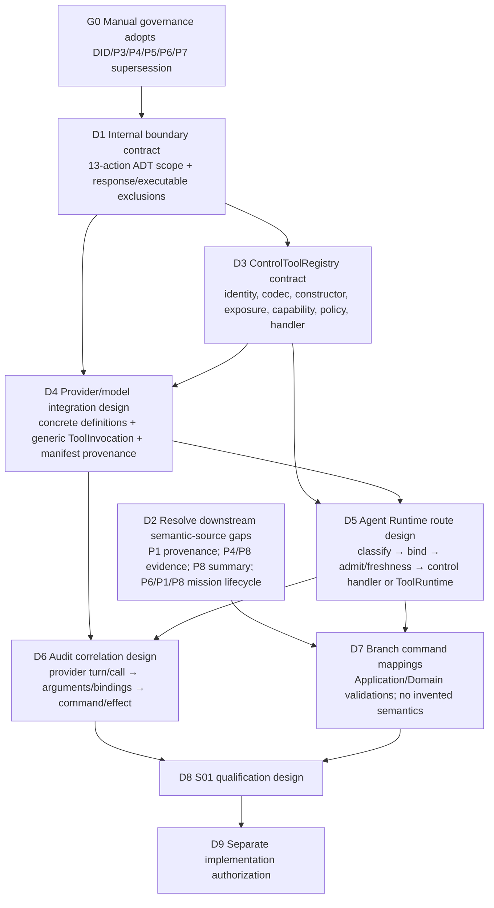

# Migration Boundary and Implementation Dependency DAG

**Date:** 2026-09-27
**Status:** Architecture sequencing proposal only; no implementation authorized
**Baseline:** clean production facts refer to `master@063d40d236ef73aa2f007d057f9f6d045512fc21`.

## Migration boundary

Current clean-HEAD shape:

```text
ModelContext.prepareTurn
  → PortableModelRequest + OutputContractRef
  → ProviderPort / CanonicalProviderEvent
  → model-context.decodeTurn
  → ModelOutput + AgentDirective union
  → AgentRuntime freshness/safety/handler dispatch
  → ToolRuntime or Application/Execution settlement
```

Candidate after frozen-design supersession:

```text
ModelContext.prepareTurn
  → executable definitions + projected control definitions
  → provider-compatible request
  → generic provider-neutral ToolInvocation
  → exact registry classification
      ├─ Executable → ToolRuntime
      └─ Control → codec → internal AgentAction → Runtime control policy
  → Application command / Domain effect / Execution settlement
  → bounded result → next turn
```

The migration boundary replaces only the universal semantic-output bridge. It
preserves the provider-neutral event layer, `PortableModelRequest`, ToolRuntime
semantics, authority resolution, Application command receipts, Domain events,
Execution settlement/recovery, and existing session history.

## Dependency DAG

This DAG states the required order of architectural dependencies; it is not
task authorization or an implementation plan.



G0 must be manual governance because the current `AGENTS.md` makes
`docs/design/**` the frozen source of truth and prohibits the Planning/Coding
Agent from modifying it. This review has created a planning proposal only.
S01 qualification is downstream of the new boundary and must not use the
old universal `arbor_directive` representation as its pass condition.

## Four former field-source gaps in the DAG

| Gap | Owning design boundary | DAG dependency | What must be decided before affected action implementation |
|---|---|---|---|
| `AssignWork.Provenance` | P1/Application command mapping and Work provenance semantics | D2 → D7 | Authoritative source/transform for both predecessor and reason; no `why` copy or current-Work inference without governance. |
| ToolObservation source identity | Control-tool evidence selection plus P4 observation provenance / P8 EvidenceRecord binding | D2 → D7 | Freeze the model-selectable source handle, membership/authenticity check, and durable EvidenceRecord association. |
| `ConcludeVerification.summaryRef` | Control-tool summary semantics + Runtime content persistence + P8 conclusion persistence/state/event contract | D2 → D7 | The prior assessment recommends model-authored summary content and a Runtime-created content ref; governance must decide that semantic ownership, and P8 must still define the durable Verification-to-summary association. |
| `initialWork → VerificationMission` | P6 formation / P1 AssignWork / P8 Verification lifecycle | D2 → D7 | Whether the parent supplies a valid mission at formation or a later governed lifecycle transition does; no placeholder or inferred criteria. |

These are no longer one “AgentDirective v2 schema readiness” gate. They remain
separate downstream design dependencies for the action/command paths that
need them. Actions with unrelated complete mappings may be designed
independently after governance.

## Clean-HEAD gap disposition

| Finding | New owner / classification | Depends on |
|---|---|---|
| `compileTurn` does not inject `arbor_directive` in clean HEAD. | Model Context control-definition exposure integration. The target compiles concrete ControlToolRegistry projections; there is no reserved universal directive tool. | D3 + D4 |
| Clean-HEAD `Communicate` handler only returns an Observation, while frozen P6 specifies durable `SendMessage`. | P6 control handler integration: registry action → existing `SendMessage` Application path. | D3 + D5 + communication semantics already closed |
| P8 commands exist without model-facing verifier control tools/handlers. | P8 control exposure and Agent Runtime handler integration. Observation-source and summary-association gaps remain separately gated. | D2 + D3 + D5 + D7 |

The uncommitted working-tree `compiler.ts` injection of `arbor_directive`
belongs to the old representation direction and is excluded from clean-HEAD
facts. This review leaves it unchanged.

## S01 redefinition

S01 should become **Control/Executable Route Qualification**, not “make
Qwen emit a valid canonical AgentDirective.” A later authorized S01 design
should require a real-provider turn to exercise both classifications:

1. **Executable route:** a single small executable tool call is assembled in
   the request, normalized by the provider adapter, classified as executable,
   authorized by ToolRuntime, and returns a bounded Observation that is
   available to the next turn.
2. **Control route:** a small control tool call is visible in the request,
   decoded by its registry codec into one internal AgentAction, receives
   trusted Runtime bindings and policy/admission checks, reaches its owning
   Application command or Execution settlement, and settles according to the
   frozen semantics.
3. **Failure route:** an unknown tool, malformed arguments, missing semantic
   input, or denied authority fails closed or follows the already frozen
   bounded repair path; it must never be converted into a guessed action.
4. **Audit route:** providerTurnId and toolCallId can be joined to the decoded
   action/arguments, Runtime binding references, and resulting command/event
   or settlement.
5. **Compatibility:** no model-facing `arbor_directive` union is required;
   S02–S07 remain their prior evidence and are rerun only if implementation
   changes affect their paths.

A realistic single S01 control proof should select an already semantically
closed action and existing fixture, avoiding the four unresolved downstream
fields. `ClaimCompletion` can prove action decode → Runtime settlement →
verification-consumer trigger; an Application-command-backed control action
can be added if the S01 closure specifically needs proof of CommandGateway
consumption. S01 remains **not authorized** by this architecture proposal.

## Historical version handling

- Stop generating `agent-directive-v1` as the universal Agent output contract
  after frozen governance adoption.
- Do not introduce `agent-directive-v2` for the same purpose.
- Preserve old ProviderTurn `outputContractRef` and Session `directiveKinds`
  for historical reading; no full AgentDirective payload migration is
  indicated by clean-HEAD persistence.
- Keep independent output contracts for compaction or bounded text output if
  their owning designs still require them.
- Keep `AgentAction` transient. Persist durable Application/Domain effects and
  the separately governed audit correlation data, not the entire ADT.
